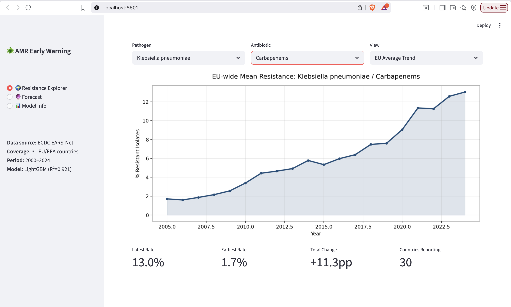
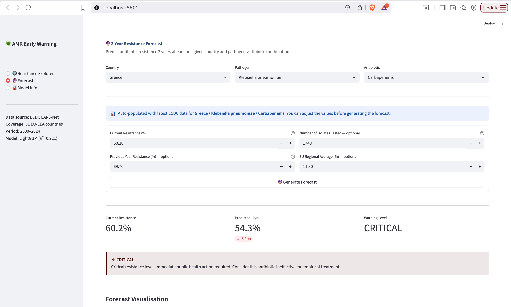
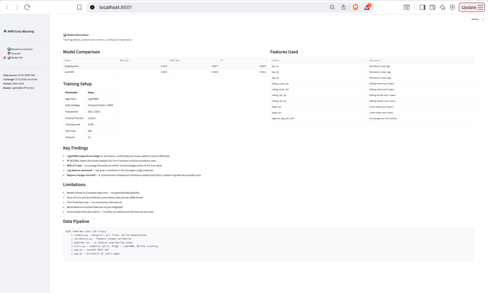
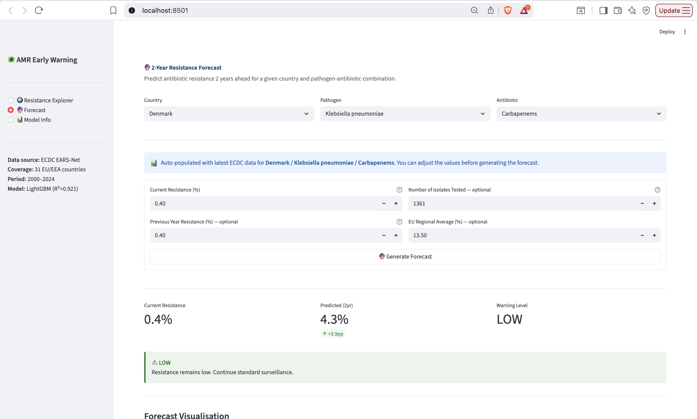
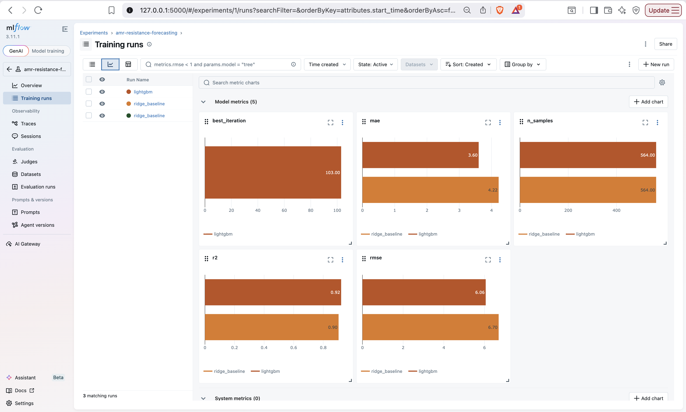
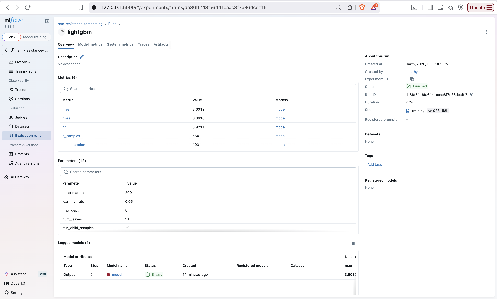
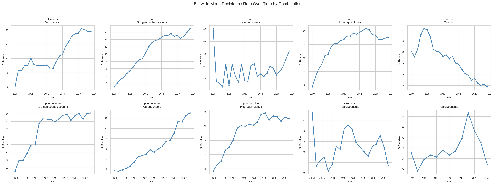
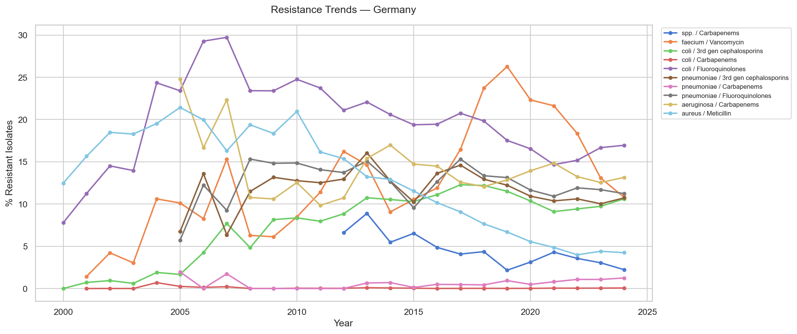

# AMR Early Warning System 🦠

> A production-grade machine learning system that forecasts antibiotic resistance rates 2 years ahead across 31 European countries, built on real ECDC EARS-Net surveillance data.

[](https://github.com/adhithyan-s/arm-early-warning/actions/workflows/ci.yml)


---

## Why This Project Exists

Antimicrobial resistance (AMR) kills over 35,000 people annually in the EU/EEA. 
Public health systems need **early warning** — not just dashboards showing what happened, but forecasts of what is about to happen.

This system ingests 25 years of ECDC surveillance data, engineers time-series features that capture resistance momentum and geographic context, and serves 2-year forecasts via a REST API with a Streamlit interface. The goal is to give public health planners enough lead time to act before resistance reaches critical levels.

---

## UI Demo

| Resistance Explorer | Forecast — High Resistance Country |
|---|---|
|  |  |

| Model Info | Forecast — Low Resistance Country |
|---|---|
|  |  |

---

## Results

| Model | MAE | RMSE | R² |
|---|---|---|---|
| Ridge Baseline | 4.22pp | 6.70pp | 0.904 |
| **LightGBM** | **3.60pp** | **6.06pp** | **0.921** |

- Trained on years 2000–2020, tested on 2021–2024 (temporal split — no data leakage)
- 6,134 rows across 31 countries and 10 pathogen-antibiotic combinations
- MAE of 3.6pp means forecasts are within 3.6 percentage points on average

### Predicted vs Actual (LightGBM)


### Feature Importance


---

## MLflow Experiment Tracking

All training runs are tracked with MLflow — parameters, metrics, and model artifacts are logged automatically on every run.

```bash
mlflow ui
# Opens at http://localhost:5000
```

| Runs Overview | Best Run Detail |
|---|---|
|  |  |

| Run | MAE | RMSE | R² |
|---|---|---|---|
| ridge_baseline | 4.2207 | 6.6977 | 0.9037 |
| lightgbm | 3.6019 | 6.0616 | 0.9211 |

---

## EDA Insights

### EU-wide Resistance Trends (all 10 combinations)



### Country Deep Dive — Germany



---

## Architecture

```
ECDC EARS-Net CSVs (20 files, 2000–2024)
        │
        ▼
loaders.py ── merge resistant count + percentage files
        │       derive NumIsolates from N and pct files
        ▼
validators.py ── Pandera schema validation
        │         type checks, range checks, row-level integrity
        ▼
engineer.py ── 12 feature engineering steps
        │       lag features, rolling stats, slope, regional avg
        ▼
train.py ── temporal split → Ridge baseline + LightGBM
        │    MLflow experiment tracking, model artifacts saved
        ▼
app.py (FastAPI) ── REST API
        │            POST /predict  GET /health  GET /combinations
        ▼
app.py (Streamlit) ── 3-page interactive UI
                       Resistance Explorer | Forecast | Model Info
```

---

## Project Structure

```
amr-early-warning/
├── src/
│   ├── data/
│   │   ├── loaders.py        # ECDC data loading and merging
│   │   └── validators.py     # Pandera schema validation
│   ├── features/
│   │   └── engineer.py       # 12 feature engineering functions
│   ├── models/
│   │   ├── train.py          # Training pipeline + MLflow logging
│   │   └── evaluate.py       # Metrics and visualisation
│   └── api/
│       └── app.py            # FastAPI REST API
├── tests/                    # 51 pytest tests
│   ├── test_loaders.py
│   ├── test_validators.py
│   └── test_features.py
├── notebooks/
│   └── 01_eda.ipynb          # Exploratory data analysis
├── docs/
│   ├── adr/                  # Architecture Decision Records
│   │   ├── 001-data-sources.md
│   │   ├── 002-model-selection.md
│   │   └── 003-ci-ruff-linting.md
│   └── screenshots/          # UI and MLflow screenshots
├── reports/figures/          # EDA and model evaluation plots
├── models/
│   └── model_metadata.json   # Model metrics and feature info
├── app.py                    # Streamlit UI
├── Dockerfile
├── docker-compose.yml
├── ruff.toml
└── requirements.txt
```

---

## Quickstart

### Prerequisites

- Python 3.11
- Docker (optional, for containerised deployment)
- ECDC EARS-Net data files in `data/raw/` — see [Data Setup](#data-setup)

### Local Setup

```bash
# 1. Clone and create environment
git clone https://github.com/adhithyan-s/arm-early-warning.git
cd arm-early-warning
python -m venv .venv
source .venv/bin/activate        # Windows: .venv\Scripts\activate
pip install -r requirements.txt
pip install -e .

# 2. Add ECDC data (see Data Setup section below)

# 3. Train the model
python -m src.models.train

# 4. Start the API (Terminal 1)
uvicorn src.api.app:app --port 8000

# 5. Start the UI (Terminal 2)
streamlit run app.py
# Opens at http://localhost:8501
```

### Docker

```bash
# Build and run the API
docker build -t amr-early-warning .
docker run -p 8000:8000 amr-early-warning

# Or use docker-compose
docker-compose up
```

### Run Tests

```bash
pytest tests/ -v
# 51 tests across loaders, validators, and feature engineering
```

---

## Data Setup

Data comes from [ECDC EARS-Net](https://www.ecdc.europa.eu/en/about-us/networks/disease-networks-and-laboratory-networks/ears-net-data)
— the largest publicly funded AMR surveillance system in Europe.

**Download steps:**

1. Go to the [ECDC Surveillance Atlas](https://atlas.ecdc.europa.eu/public/index.aspx)
2. Select: `Antimicrobial resistance` → Pathogen → Antibiotic → Indicator → Load data
3. Set Resolution to `Country + Year`, range `2000–2024`
4. Click the download icon → export as CSV

For each combination below, download **two files** — change only the Indicator:

- `{KEY}_N.csv` — Indicator: **R - resistant isolates**
- `{KEY}_pct.csv` — Indicator: **R - resistant isolates percentage**

| Key | Pathogen | Antibiotic |
|---|---|---|
| KLPN_Carbapenems | Klebsiella pneumoniae | Carbapenems |
| KLPN_Fluoroquinolones | Klebsiella pneumoniae | Fluoroquinolones |
| KLPN_3GenCeph | Klebsiella pneumoniae | 3rd gen cephalosporins |
| ECOL_Carbapenems | Escherichia coli | Carbapenems |
| ECOL_Fluoroquinolones | Escherichia coli | Fluoroquinolones |
| ECOL_3GenCeph | Escherichia coli | 3rd gen cephalosporins |
| SAUR_Meticillin | Staphylococcus aureus | Meticillin |
| EFAM_Vancomycin | Enterococcus faecium | Vancomycin |
| PAER_Carbapenems | Pseudomonas aeruginosa | Carbapenems |
| ACIN_Carbapenems | Acinetobacter spp. | Carbapenems |

Place all 20 files in `data/raw/`. This directory is git-ignored — data is never committed to the repository.

---

## API Reference

The FastAPI server runs at `http://localhost:8000`.
Interactive Swagger docs at `http://localhost:8000/docs`.

### `POST /predict`

**Request:**

```json
{
  "country_code": "DE",
  "pathogen": "Klebsiella pneumoniae",
  "antibiotic": "Carbapenems",
  "current_resistance_pct": 2.1,
  "previous_resistance_pct": 1.8,
  "num_isolates": 850,
  "regional_avg_pct": 8.3
}
```

**Response:**

```json
{
  "country_code": "DE",
  "pathogen": "Klebsiella pneumoniae",
  "antibiotic": "Carbapenems",
  "current_resistance_pct": 2.1,
  "predicted_resistance_pct": 5.52,
  "forecast_horizon_years": 2,
  "warning_level": "MODERATE",
  "warning_message": "Moderate resistance detected. Enhanced surveillance recommended.",
  "model_mae_pp": 3.6019,
  "model_r2": 0.9211
}
```

### `GET /health`

Returns model status, type, and evaluation metrics.

### `GET /combinations`

Returns all 10 valid pathogen-antibiotic combinations the model supports.

---

## Features Engineered

| Feature | Description | Motivation |
|---|---|---|
| `lag_1yr` | Resistance 1 year ago | Strongest single predictor |
| `lag_2yr` | Resistance 2 years ago | Medium-term momentum |
| `lag_3yr` | Resistance 3 years ago | Long-term momentum |
| `rolling_mean_3yr` | 3-year rolling average | Smooths year-to-year noise |
| `rolling_mean_5yr` | 5-year rolling average | Long-term trend level |
| `rolling_std_3yr` | 3-year rolling std dev | Detects volatility and instability |
| `rolling_std_5yr` | 5-year rolling std dev | Long-term stability signal |
| `slope_3yr` | Linear slope over 3 years | Short-term trend direction |
| `slope_5yr` | Linear slope over 5 years | Long-term trend direction |
| `regional_avg_excl_self` | EU average excl. this country | Geographic context |
| `log_num_isolates` | Log of isolates tested | Data reliability weight |
| `years_of_data` | Years of surveillance available | Surveillance maturity |

All features use only data up to year T — no future information leaks into the training set.

---

## Architecture Decisions

Key engineering and research decisions are documented as Architecture Decision Records:

- [ADR 001](docs/adr/001-data-sources.md) — Why ECDC EARS-Net over WHO GLASS
- [ADR 002](docs/adr/002-model-selection.md) — Why LightGBM over XGBoost and neural networks
- [ADR 003](docs/adr/003-ci-ruff-linting.md) — CI linting issue root cause and resolution

---

## Limitations and Future Work

- **European data only** — not generalisable to other regions without retraining on WHO GLASS data
- **No uncertainty quantification** — point forecasts only; conformal prediction intervals would improve actionability for clinicians
- **Annual granularity** — monthly surveillance data would improve short-term forecast accuracy
- **No prescription rate features** — antibiotic consumption data (ESAC-Net) is a known AMR driver not yet integrated
- **Static model** — requires annual retraining as new ECDC data is released each November
- **Regime changes** — the K. pneumoniae carbapenem spike post-2018 shows lag features partially miss sudden resistance jumps; a
  change-point detection component would help

---

## Tech Stack

| Layer | Tool |
|---|---|
| Data loading | pandas, custom ETL |
| Data validation | Pandera |
| Feature engineering | pandas, NumPy |
| ML baseline | scikit-learn (Ridge) |
| ML model | LightGBM |
| Experiment tracking | MLflow |
| API | FastAPI + Pydantic |
| UI | Streamlit |
| Containerisation | Docker |
| CI/CD | GitHub Actions |
| Linting | ruff |
| Testing | pytest (51 tests) |

---

## About

Built as a production-grade data science portfolio project demonstrating end-to-end ML system design — from raw surveillance data ingestion through feature engineering, model training with experiment tracking, REST API deployment, and an interactive UI.

The project deliberately avoids Kaggle datasets and tutorial pipelines. Every design decision is documented, every function is tested, and the system is deployable via Docker in a single command.
